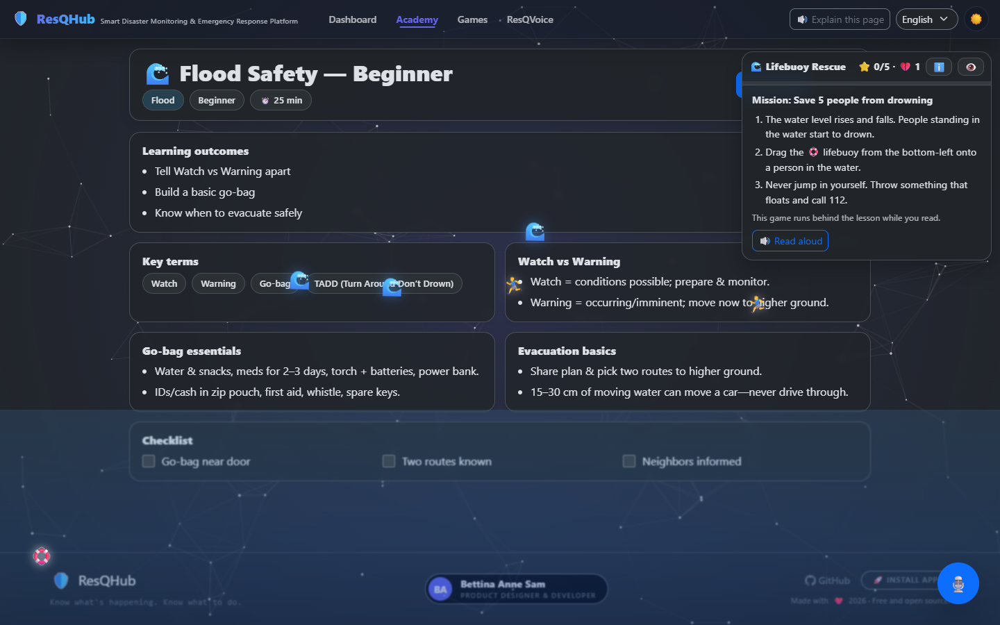
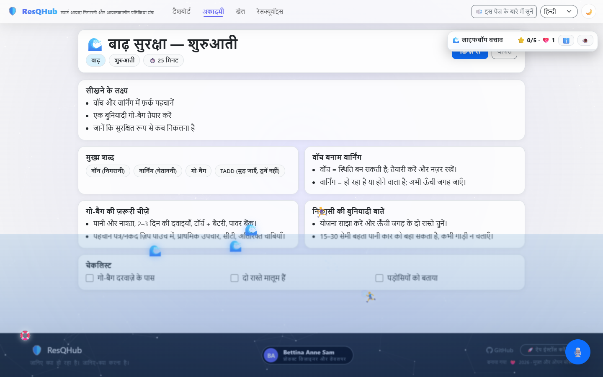
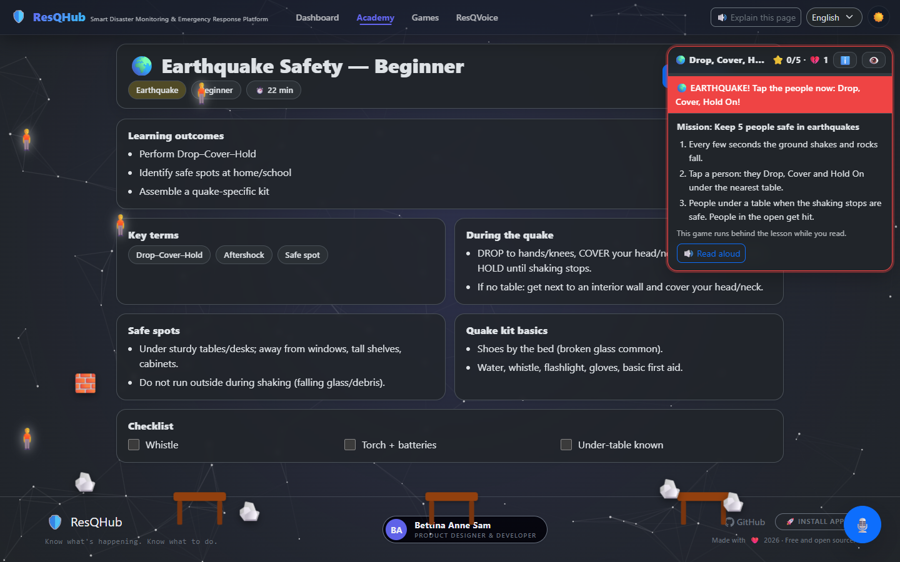
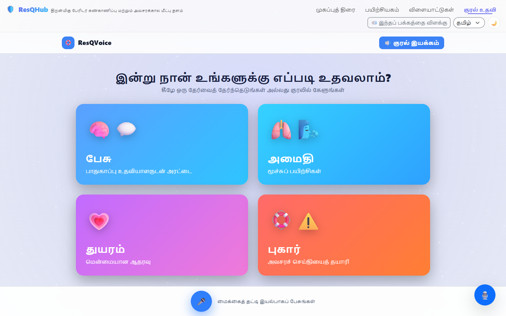

# ResQHub

**Live disaster alerts and a preparedness academy for India and the world. Free, open source, no paid services.**

**Live site:** https://disaster-mgmt-resqhub.netlify.app


## What it does

- **Live hazard map.** Earthquakes, cyclones, floods and wildfires from public feeds, colour-coded by severity, with filters, a heat layer, a 24-hour playback and CSV/PNG export. Starts on India and nearby; one click for the whole world.
- **Find yourself, or any place.** A locate button and a place search (OpenStreetMap Nominatim) move the map, drop a pin, and link out to Google Maps. The nearest hospitals, police stations, fire stations and shelters are listed for that point, with call and directions links.
- **Alerts that matter.** The most serious current events first, each with its source and time. A sound cue plays when a new high-severity event appears.
- **A guide that reacts.** The ResQ crew on the home page changes mood when something serious is happening in your region and gives a safety tip when you click it. A small snake game ("stock the kit") plays itself in the hero and can be played with the arrow keys, swipe or an on-screen pad.
- **Emergency numbers** for 18 countries, one tap to call.
- **Community reports.** Reports are saved on your device only and are always shown as *unverified*.
- **Preparedness Academy.** Lessons, quizzes and a certificate that is only unlocked by passing the quiz. Each lesson has a **game running in the background while you read** (lifebuoy rescue for floods, extinguisher for fires, shelter run for cyclones, drop-cover-hold for earthquakes, and a road-accident helper). A HUD explains how it works, counts your score and reads the instructions aloud.
- **15 practice games** (5 hazards x 3 levels), playable by drag-and-drop, tapping or keyboard, with progress tracked.
- **ResQVoice assistant.** Ask safety questions by voice or text, get breathing exercises and gentle support, or prepare an emergency message to share. If the AI service is unavailable, built-in guidance answers instead.
- **Explain this page.** One button describes the current page and what to do on it, and reads it aloud in the selected language (when the device has a voice for it).
- **English, Hindi and Tamil everywhere.** Pages, lessons, quizzes, the hub and the assistant all follow one language switch.
- **Light and dark theme**, installable, works offline.

| Lesson with its background game | Hindi, light theme |
|---|---|
|  |  |

| Earthquake lesson | ResQVoice (Tamil) | Phone (Hindi) |
|---|---|---|
|  |  |  |

## Where the data comes from

All sources are free and need no API key.

| Data | Source |
|---|---|
| Earthquakes (worldwide, and magnitude 2.5+ around India) | [USGS](https://earthquake.usgs.gov/earthquakes/feed/) |
| Floods, tropical cyclones, wildfires | [GDACS](https://www.gdacs.org) (UN and EU) |
| Wildfires, volcanoes, storms (fills gaps) | [NASA EONET](https://eonet.gsfc.nasa.gov) |
| Hospitals, police, fire stations, shelters | [OpenStreetMap](https://www.openstreetmap.org) via the Overpass API |
| Place search | OpenStreetMap Nominatim (on submit only, per their usage policy) |
| Map tiles | OpenStreetMap |

Feeds are fetched in parallel, and one failing feed never blocks the others. The last good snapshot is cached, so you still see data if every feed is unreachable.

## What it is not

Be clear about this before you rely on it.

- **It is not an official warning service.** It repeats public feeds. Follow IMD, NDMA and your local authorities.
- The "India" view is a bounding box, so it includes nearby countries.
- Community reports are **not shared between users**. There is no backend database. They live in your browser's storage.
- The ResQVoice report does **not** contact anyone. It builds a message you can call in (112), WhatsApp, text or copy.
- "Status" on a live event is your own checklist, saved on your device.
- Google Maps is only linked to, not embedded: its map API needs a billing account, and this project uses no paid services.
- OpenStreetMap coverage of shelters and phone numbers varies a lot between places.
- Hindi and Tamil text was written without a native-speaker review. Corrections are welcome.
- The assistant's guidance is general public-safety advice, not medical or legal advice.

## Run it

Needs Node 20 or newer.

```bash
cd client
npm install
npm run dev        # http://localhost:3000
npm test           # unit and behaviour tests
npm run build      # production build in client/build
```

### Optional: enable the AI assistant

The assistant works without any key using built-in guidance. To turn on Gemini answers, set `GEMINI_API_KEY` as a **server-side** environment variable (on Netlify: Site settings, Environment variables). The browser calls `/api/chat`, a Netlify Function in `netlify/functions/chat.mjs`, so the key never reaches the client. See `client/.env.example`. If the key is missing, wrong or out of quota, the app silently falls back to built-in guidance.

## How it is built

- React 19, Vite, React Router, Leaflet, Bootstrap. No backend.
- `client/src/services/liveService.js`: fetches and normalises the feeds, merges, de-duplicates, caches, and holds community reports.
- `client/src/contexts/LiveDataContext.jsx`: loads the feeds once and shares them with the hero guide and the dashboard.
- `client/src/components/lesson/`: the five background lesson games, `LessonScene.jsx` (HUD, score, how-to) and `data/scenes.js` (their trilingual text). Scenes report what happens through `utils/sceneEvents.js`.
- `client/src/components/SnakeBanner.jsx`, `MascotGuide.jsx`, `ExplainButton.jsx`, `PlaceSearch.jsx`.
- `client/src/i18n/`: short interface strings live in `en/hi/ta.json` (used with `t("key")`). Longer content (lessons, quizzes, game labels) is translated at runtime by `AutoTranslate.jsx` from the dictionaries in `dict.*.js`. A test fails if any lesson or quiz string is missing a translation.
- `client/public/sw.js`: small offline service worker.
- `netlify/functions/chat.mjs`: the only server code.

## Tests

`npm test` covers the data layer, the assistant fallback, nearby-help parsing, translation completeness for all lesson and quiz text, runtime language switching, the lesson-id to scene mapping, all 15 games rendering, tap/keyboard play, and the quiz-to-certificate flow.

## What changed from v1

v1 was a showcase with a fake login, hard-coded incidents, a report form that claimed "help is on the way" with no backend behind it, and a language switch that only changed the home page. v2 uses live feeds, removes the invented numbers and claims, moves the AI key off the client, makes the games playable on phones, fixes the certificate flow, makes the language and light theme work across the app, and adds offline support.

## Ideas for next

- A shared, moderated backend for community reports.
- Push notifications for new severe events near a saved location.
- State-level alerts for India (IMD/CWC feeds have no clean public API yet).
- Replace the weakest practice games with new ones.

## Licence

MIT. Built by [Bettina Anne Sam](https://github.com/Bettina-Sam).
