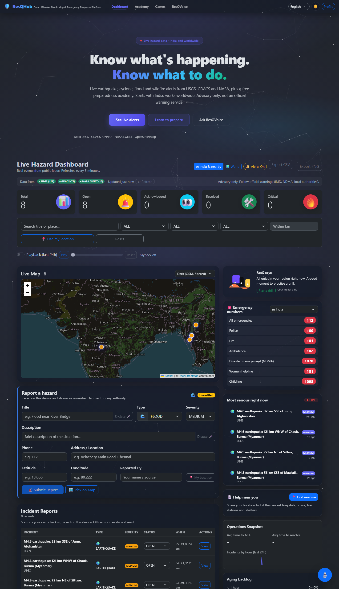
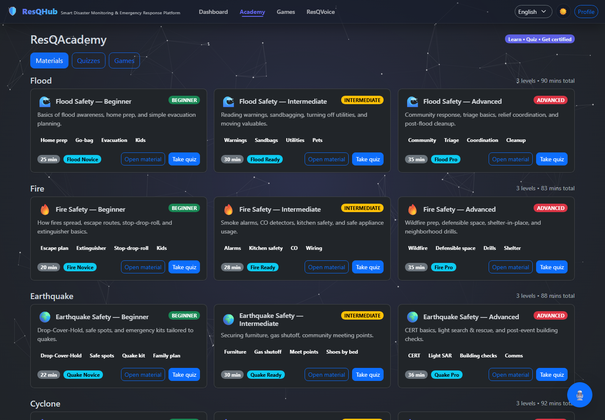
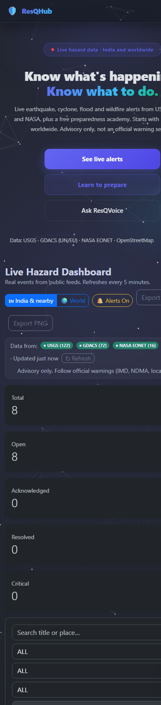

# ResQHub

**Live disaster alerts and a preparedness academy for India and the world. Free, open source, no paid services.**

**Live site:** https://disaster-mgmt-resqhub.netlify.app



## What it does

- **Live hazard map.** Earthquakes, cyclones, floods and wildfires from public feeds, colour-coded by severity, with filters, a heat layer, a 24-hour playback and CSV/PNG export. Starts on India and nearby; one click for the whole world.
- **Alerts that matter.** The most serious current events first, each with its source and time. A sound cue plays when a new high-severity event appears.
- **Help near you.** After you share your location, it lists the nearest hospitals, police stations, fire stations and shelters (OpenStreetMap), with call and directions links.
- **Emergency numbers** for 18 countries, one tap to call.
- **Community reports.** You can report a hazard from the form. Reports are saved on your device only and are always shown as *unverified*.
- **Preparedness Academy.** Lessons, quizzes and a certificate that is only unlocked by passing the quiz. 15 practice games (5 hazards x 3 levels) that you can play by drag-and-drop, tapping or keyboard. Your progress is tracked.
- **ResQVoice assistant.** Ask safety questions by voice or text in English, Hindi or Tamil. If the AI service is unavailable, built-in guidance answers instead, so it still works with no key and no internet quota.
- **Works offline.** Installable as an app. The shell, emergency numbers, guidance and the last data you loaded stay available without a connection.
- **Three languages:** English, Hindi, Tamil.

| Academy | Phone |
|---|---|
|  |  |

## Where the data comes from

All sources are free and need no API key.

| Data | Source |
|---|---|
| Earthquakes (worldwide, and magnitude 2.5+ around India) | [USGS](https://earthquake.usgs.gov/earthquakes/feed/) |
| Floods, tropical cyclones, wildfires | [GDACS](https://www.gdacs.org) (UN and EU) |
| Wildfires, volcanoes, storms (fills gaps) | [NASA EONET](https://eonet.gsfc.nasa.gov) |
| Hospitals, police, fire stations, shelters | [OpenStreetMap](https://www.openstreetmap.org) via the Overpass API |
| Map tiles | OpenStreetMap |

Feeds are fetched in parallel, and one failing feed never blocks the others. The last good snapshot is cached, so you still see data if every feed is unreachable.

## What it is not

Be clear about this before you rely on it.

- **It is not an official warning service.** It repeats public feeds. Follow IMD, NDMA and your local authorities.
- The "India" view is a bounding box, so it includes nearby countries (for example, quakes in Myanmar or Afghanistan appear).
- Community reports are **not shared between users**. There is no backend database. They live in your browser's storage.
- "Status" (open / acknowledged / resolved) on a live event is your own checklist, saved on your device.
- OpenStreetMap coverage of shelters and phone numbers varies a lot between places.
- The built-in assistant guidance is general public-safety advice, not medical or legal advice.

## Run it

Needs Node 20 or newer.

```bash
cd client
npm install
npm run dev        # http://localhost:3000
npm test           # unit and behaviour tests
npm run build      # production build in client/build
```

### Optional: enable the AI assistant

The assistant works without any key using built-in guidance. To turn on Gemini answers, set `GEMINI_API_KEY` as a **server-side** environment variable (on Netlify: Site settings, Environment variables). The browser calls `/api/chat`, a Netlify Function in `netlify/functions/chat.mjs`, so the key never reaches the client. See `client/.env.example`. If the key is missing, wrong or out of quota, the app silently falls back to built-in guidance.

## How it is built

- React 19, Vite, React Router, Leaflet, Bootstrap. No backend.
- `client/src/services/liveService.js`: fetches and normalises the three feeds, merges, de-duplicates, caches, and holds community reports and triage state.
- `client/src/services/nearbyService.js`: Overpass queries for nearby help.
- `client/src/services/assistant.js` and `client/src/data/guidance.js`: AI call with built-in multilingual fallback.
- `client/public/sw.js`: small offline service worker.
- `netlify/functions/chat.mjs`: the only server code.

The build takes about a second (it was over four minutes on Create React App).

## Tests

`npm test` covers the data layer (normalisers for each feed, severity rules, de-duplication, region check, local reports), the assistant fallback, the nearby-help parsing, translation completeness, all 15 games rendering, tap/keyboard play, and the quiz-to-certificate flow.

## What changed from v1

v1 was a showcase with a fake login, hard-coded incidents and no working backend. v2 replaces the mock data with live feeds, removes the invented numbers and claims, moves the AI key off the client, makes the games playable on phones, fixes the certificate flow, and adds Hindi and offline support.

## Ideas for next

- A shared, moderated backend for community reports.
- Push notifications for new severe events near a saved location.
- State-level alerts for India (IMD/CWC feeds have no clean public API yet).
- Per-event safety guidance linked from each alert.

## Licence

MIT. Built by [Bettina Anne Sam](https://github.com/Bettina-Sam).
